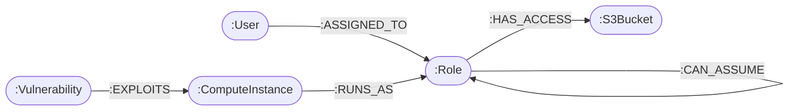

# CloudSec Blast-Radius Graph Analyzer

A cloud security graph intelligence platform backed by **CognoDB** to simulate compromised asset lateral movement and uncover multi-hop permission escalation paths.

---

## 1. Why a Graph Database?

In identity and access management (IAM), calculating the **blast radius** of a compromised credential or compute instance requires navigating indirect relationships (Users $\to$ Roles $\to$ Assumed Roles $\to$ Instances $\to$ Target Storage Buckets).

* **The Relational Bottleneck:** In SQL, traversing arbitrary depth or evaluating circular role-assumption chains requires complex recursive Common Table Expressions (`WITH RECURSIVE`) and successive multi-table `JOIN` operations that degrade quickly as connection depth grows.
* **The Graph Advantage:** In CognoDB (using openCypher), lateral movement is evaluated as an index-free adjacency graph pattern. Multi-hop queries are expressed in clean, declarative patterns like `(v)-[:EXPLOITS]->()-[:RUNS_AS*1..3]->(target)`, executing with minimal latency.

---

## 2. Graph Data Model



### Node Labels & Properties
* **`User`**: `id`, `name`, `roleType`
* **`Role`**: `id`, `name`
* **`ComputeInstance`**: `id`, `name`, `ip`
* **`S3Bucket`**: `id`, `name`, `classification`
* **`Vulnerability`**: `cve`, `name`, `severity`

---

## 3. Key Cypher Queries

### Multi-Hop Blast-Radius Traversal (Awkward in SQL)
Finds all downstream entities reachable within 1 to 4 hops starting from a compromised node:
```cypher
MATCH (start)
WHERE start.id = $startId OR start.cve = $startId
MATCH path = (start)-[r*1..4]-(target)
WITH collect(path) AS paths
UNWIND paths AS p
UNWIND nodes(p) AS n
UNWIND relationships(p) AS rel
RETURN collect(DISTINCT n) AS nodes, collect(DISTINCT rel) AS links
```

### Direct Asset Access Audit
Finds which roles have admin access to critical data stores:
```cypher
MATCH (r:Role)-[acc:HAS_ACCESS]->(b:S3Bucket {classification: 'CRITICAL'})
RETURN r.name AS RoleName, acc.level AS AccessLevel, b.name AS TargetBucket
```

---

## 4. Setup & Running Locally

### Prerequisites
* Node.js 18+
* A free instance on [CognoDB Cloud](https://console.cognodb.com/signup)

### Installation
1. Clone the repository:
   ```bash
   git clone <YOUR_REPO_URL>
   cd blast-radius-graph
   ```
2. Install dependencies:
   ```bash
   npm install
   ```
3. Configure environment variables in `.env.local`:
   ```env
   COGNODB_URI=bolt+s://<instance-id>.databases.cognodb.cloud
   COGNODB_USER=cognodb
   COGNODB_PASSWORD=your_instance_password
   ```
4. Seed the database:
   ```bash
   npm run seed
   ```
5. Run the development server:
   ```bash
   npm run dev
   ```
6. Open [http://localhost:3000](http://localhost:3000).